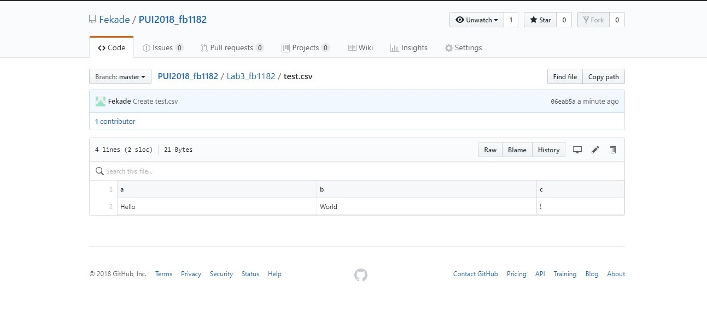
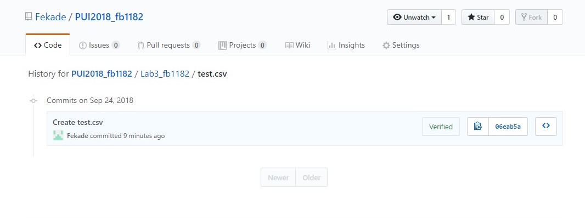
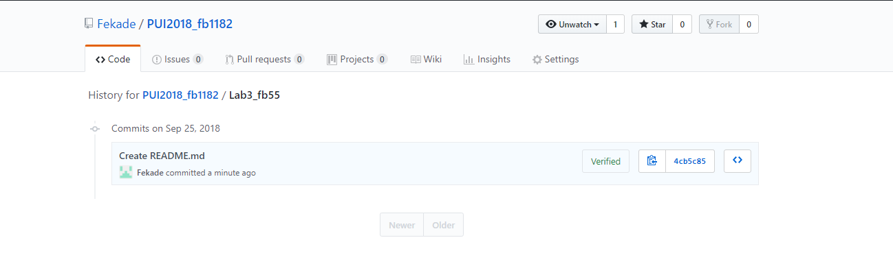

 <h1>Removing sensitive files from repos</h1>  

1. Created a file in PUI2018_fb1182 repo, inside the folder Lab3_fb1182 called test.csv  

2. Commited this file to my repo. See below, screenshots of this particular file's creation history and folder HW3_fb1182's history  
 
 

3. Removed this file and its history from my PUI2018 repo; see screeshot of the result below   

